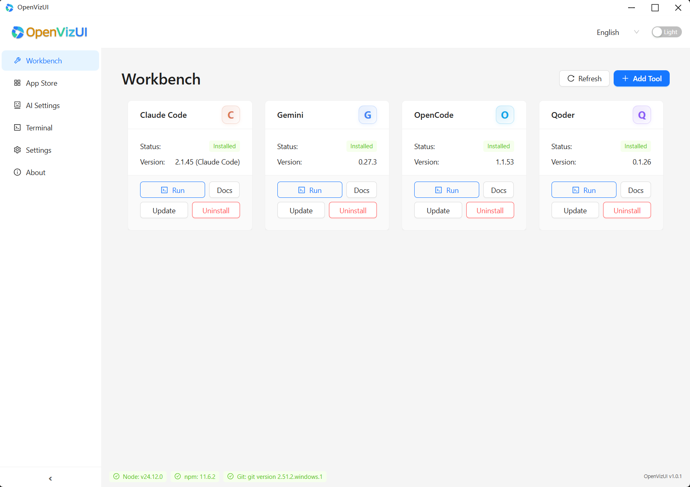
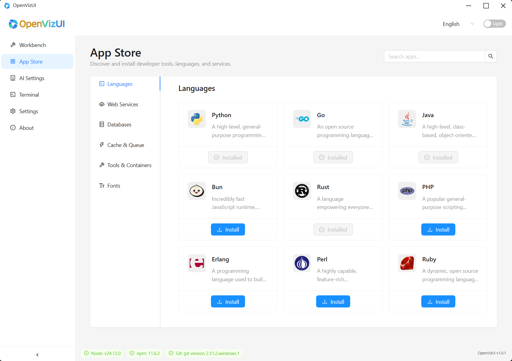
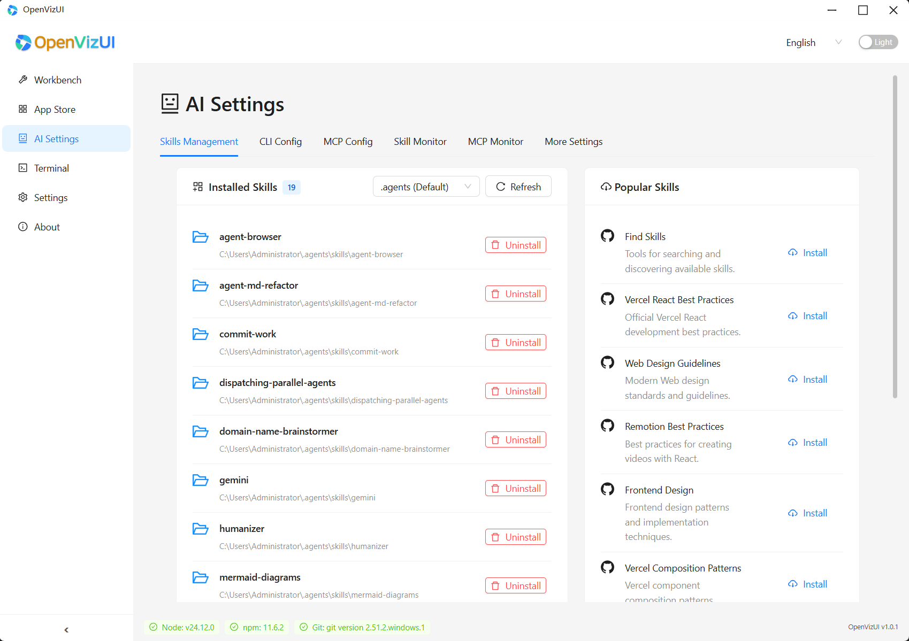

<div align="center">
  <p>
    <a href="../README.md">English</a> | <a href="README_zh.md">中文</a> | <a href="README_de.md">Deutsch</a> | <a href="README_es.md">Español</a> | <a href="README_fr.md">Français</a> | <a href="README_it.md">Italiano</a> | <a href="README_ja.md">日本語</a> | <a href="README_ko.md">한국어</a> | <a href="README_pt.md">Português</a> | <a href="README_ru.md">Русский</a>
  </p>
</div>
<div align="center">
  

  # OpenVizUI

  Une application de bureau moderne construite avec **Tauri**, **React**, et **Vite**.

  [](https://tauri.app/)
  [](https://react.dev/)
  [](https://vitejs.dev/)
  [](https://www.rust-lang.org/)
  [](https://www.typescriptlang.org/)
  [](https://opensource.org/licenses/Apache-2.0)
  

  [Site Officiel](https://www.openvizui.com) | [Dépôt GitHub](https://github.com/silvancoder/openvizui)
</div>

OpenVizUI est une application de bureau moderne qui offre une interface de visualisation unifiée, belle et efficace pour les outils CLI d'IA. Construite avec [Tauri](https://tauri.app/), [React](https://react.dev/) et [Vite](https://vitejs.dev/), elle exploite la puissance de Rust pour le backend et la flexibilité de React pour gérer vos flux de travail d'IA — de la gestion des compétences aux configurations complexes.

## Captures d'Écran

### 🛠️ Etabli — Gestion des Outils AI

Gérez tous vos outils AI CLI en un seul endroit. Consultez le statut d'installation et les informations de version, et exécutez, mettez à jour ou désinstallez des outils en un seul clic. Compatible avec Claude Code, Gemini, OpenCode, Qoder, GitHub Copilot et plus.



### 🏪 Boutique d'Applications — Environnement de Développement

Découvrez et installez des langages de programmation, des bases de données, des serveurs web, des systèmes de cache et des outils de conteneurs directement depuis la boutique intégrée. Catégories : Langages, Services Web, Bases de Données, Cache & File d'attente, Outils & Conteneurs.



### 🤖 Paramètres AI — Compétences & Configuration MCP

Centralisez toute la configuration AI dans un panneau. Gérez les compétences installées, configurez les paramètres CLI, configurez les serveurs MCP, surveillez l'activité. Onglets : Gestion des Compétences, Config CLI, Config MCP, Moniteur de Compétences, Moniteur MCP.



## Fonctionnalités Principales

| Fonctionnalité | Description |
|----------------|-------------|
| **Etabli Multi-outils** | Tableau de bord unifié pour Claude Code, Gemini, OpenCode, Qoder, Copilot & Codex |
| **Boutique d'Applications** | Installation/désinstallation en un clic d'outils, langages, bases de données et services |
| **Paramètres AI** | Gestion des compétences, configuration CLI, configuration MCP et surveillance en direct |
| **Terminal Intégré** | Terminal avec multi-onglets, arborescence de fichiers, recherche globale et commandes prédéfinies |
| **Internationalisation** | Support UI complet pour 10 langues : FR, EN, ZH, DE, ES, IT, JA, KO, PT, RU |
| **Thème & Apparence** | Mode clair/sombre, couleur primaire personnalisée, police et transparence de fenêtre |
| **Écosystème MCP** | Parcourir, installer et surveiller les serveurs et compétences Model Context Protocol |

## Stack Technique

-   **Frontend**:
    -   [React](https://react.dev/) + [TypeScript](https://www.typescriptlang.org/)
    -   [Vite](https://vitejs.dev/) (Outil de build)
    -   [Ant Design](https://ant.design/) (Bibliothèque de composants UI)
    -   [Tailwind CSS](https://tailwindcss.com/) (Framework CSS utilitaire)
    -   [Vitest](https://vitest.dev/) (Framework de tests unitaires)
-   **Backend**:
    -   [Tauri](https://tauri.app/) (Framework d'application basé sur Rust)

## Télécharger

Vous pouvez télécharger la dernière version d'OpenVizUI depuis la [Page des versions](https://github.com/silvancoder/openvizui/releases).

## Pour Commencer

### Prérequis

Assurez-vous d'avoir installé :

-   [Node.js](https://nodejs.org/) (version LTS recommandée)
-   [Rust](https://www.rust-lang.org/tools/install) (dernière version stable)

### Installation

1.  Clonez le dépôt :
    ```bash
    git clone https://github.com/silvancoder/openvizui.git
    cd openvizui
    ```

2.  Installez les dépendances :
    ```bash
    npm install
    ```

## Scripts de Développement

Les scripts suivants sont disponibles dans `package.json` :

-   **`npm run dev`**:
    Démarre le serveur de développement frontend (Vite). Utile pour le développement de l'interface utilisateur dans le navigateur.
    ```bash
    npm run dev
    ```

-   **`npm run tauri dev`**:
    Démarre l'application Tauri complète en mode développement.
    ```bash
    npm run tauri dev
    ```

-   **`npm run tauri build`**:
    Construit le frontend et le backend pour la production.
    ```bash
    npm run tauri build
    ```

-   **`npm run test`**:
    Exécute les tests unitaires avec Vitest.
    ```bash
    npm run test
    ```

-   **`npm run coverage`**:
    Exécute les tests unitaires et génère un rapport de couverture de code.
    ```bash
    npm run coverage
    ```

## Structure du Projet

-   `src/`: Code source frontend React.
-   `src-tauri/`: Code source backend Rust et configuration Tauri.
-   `public/`: Ressources statiques.

## Related Projects

-   [SteerDock - Another Docker GUI Management Platform](https://github.com/silvancoder/steerdock)

## Licence

Copyright 2026 The OpenVizUI Authors

Licensed under the Apache License, Version 2.0 (the "License");
you may not use this file except in compliance with the License.
You may obtain a copy of the License at

    http://www.apache.org/licenses/LICENSE-2.0

Unless required by applicable law or agreed to in writing, software
distributed under the License is distributed on an "AS IS" BASIS,
WITHOUT WARRANTIES OR CONDITIONS OF ANY KIND, either express or implied.
See the License for the specific language governing permissions and
limitations under the License.
