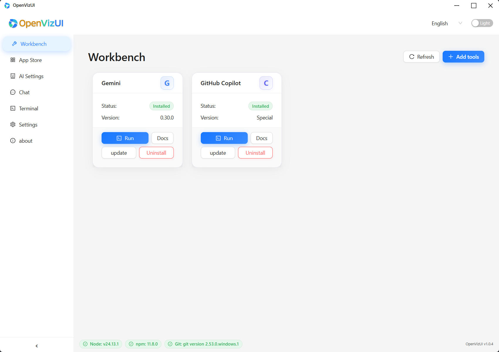
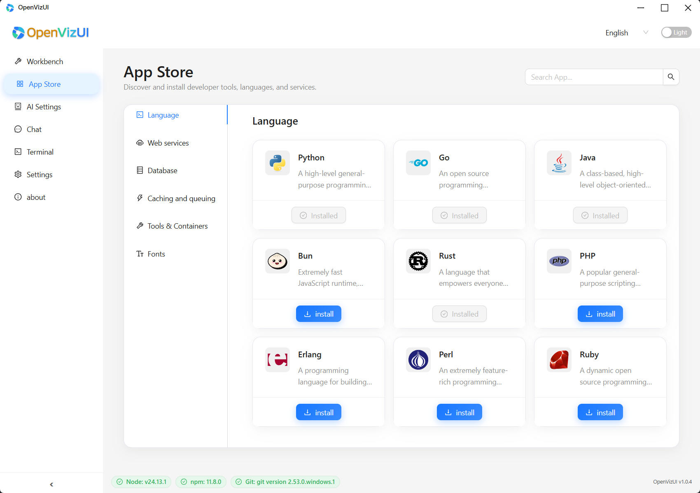
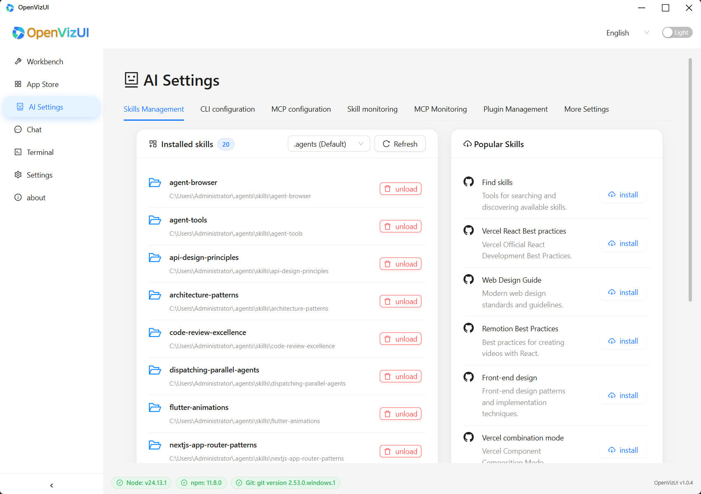

<div align="center">
  <p>
    <a href="../README.md">English</a> | <a href="README_zh.md">中文</a> | <a href="README_de.md">Deutsch</a> | <a href="README_es.md">Español</a> | <a href="README_fr.md">Français</a> | <a href="README_it.md">Italiano</a> | <a href="README_ja.md">日本語</a> | <a href="README_ko.md">한국어</a> | <a href="README_pt.md">Português</a> | <a href="README_ru.md">Русский</a>
  </p>
</div>
<div align="center">
  

  # OpenVizUI

  **Tauri**, **React**, **Vite**로 구축된 최신 데스크톱 애플리케이션입니다.

  [](https://tauri.app/)
  [](https://react.dev/)
  [](https://vitejs.dev/)
  [](https://www.rust-lang.org/)
  [](https://www.typescriptlang.org/)
  [](https://opensource.org/licenses/Apache-2.0)
  

  [공식 웹사이트](https://www.openvizui.com) | [GitHub 리포지토리](https://github.com/silvancoder/openvizui)
</div>

OpenVizUI는 AI CLI 도구를 위한 통합되고 아름답으며 효율적인 시각화 인터페이스를 제공하는 최신 데스크톱 애플리케이션입니다. [Tauri](https://tauri.app/), [React](https://react.dev/), [Vite](https://vitejs.dev/)로 구축되었으며, Rust의 강력한 백엔드 성능과 React의 유연성을 활용하여 스킬 관리부터 복잡한 구성에 이르기까지 AI 워크플로우를 관리합니다.

## 스크린샷

### 🛠️ 워크벤치 — AI 도구 관리

모든 AI CLI 도구를 한 곳에서 관리하세요. 설치 상태와 버전 정보를 확인하고, 클릭 한 번으로 도구를 실행, 업데이트 또는 제거할 수 있습니다. Claude Code, Gemini, OpenCode, Qoder, GitHub Copilot 등 지원.



### 🏪 앱 스토어 — 개발자 환경

내장 앱 스토어에서 프로그래밍 언어, 데이터베이스, 웹 서버, 캐시 시스템, 컨테이너 도구를 바로 발견하고 설치할 수 있습니다. 카테고리: 언어, 웹 서비스, 데이터베이스, 캐시 & 큐, 도구 & 컨테이너.



### 🤖 AI 설정 — 스킬 & MCP 구성

하나의 패널에서 모든 AI 설정을 중앙 관리하세요. 설치된 스킬 관리, CLI 파라미터 구성, MCP 서버 설정, 스킬 활동 모니터링. 탭: 스킬 관리, CLI 구성, MCP 구성, 스킬 Monitor, MCP Monitor.



## 핵심 기능

| 기능 | 설명 |
|------|------|
| **멀티 도구 워크벤치** | Claude Code, Gemini, OpenCode, Qoder, Copilot 등 통합 관리 |
| **앱 스토어** | 개발 도구, 언어, DB, 서비스 원클릭 설치/제거 |
| **AI 채팅 인터페이스** | 모델 선택, 파일 컨텍스트 및 터미널 통합을 갖춘 현대적인 대화 UI |
| **AI 설정** | 스킬 관리, CLI 구성, MCP 서버 설정 및 라이브 모니터링 |
| **통합 터미널** | 멀티탭 터미널, 파일 트리, 전체 검색, 명령 프리셋 |
| **국제화** | 10개 언어 UI 지원: KO, EN, ZH, DE, ES, FR, IT, JA, PT, RU |
| **테마 & 외관** | 라이트/다크 모드, 커스텀 주색, 폰트, 창 투명도 |
| **MCP 에코시스템** | Model Context Protocol 서버와 스킬 찾기, 설치, 모니터링 |

## 기술 스택

-   **프론트엔드**:
    -   [React](https://react.dev/) + [TypeScript](https://www.typescriptlang.org/)
    -   [Vite](https://vitejs.dev/) (빌드 도구)
    -   [Ant Design](https://ant.design/) (UI 컴포넌트 라이브러리)
    -   [Tailwind CSS](https://tailwindcss.com/) (유틸리티 중심 CSS 프레임워크)
    -   [Vitest](https://vitest.dev/) (단위 테스트 프레임워크)
-   **백엔드**:
    -   [Tauri](https://tauri.app/) (Rust 기반 애플리케이션 프레임워크)

## 다운로드

[릴리스 페이지](https://github.com/silvancoder/openvizui/releases)에서 OpenVizUI 최신 버전을 다운로드할 수 있습니다.

## 시작하기

### 전제 조건

다음이 설치되어 있는지 확인하세요:

-   [Node.js](https://nodejs.org/) (LTS 버전 권장)
-   [Rust](https://www.rust-lang.org/tools/install) (최신 안정 버전)

### 설치

1.  리포지토리를 복제합니다:
    ```bash
    git clone https://github.com/silvancoder/openvizui.git
    cd openvizui
    ```

2.  의존성을 설치합니다:
    ```bash
    npm install
    ```

## 개발 스크립트

`package.json`에서 다음 스크립트를 사용할 수 있습니다:

-   **`npm run dev`**:
    프론트엔드 개발 서버(Vite)를 시작합니다. 브라우저에서의 UI 개발에 유용합니다.
    ```bash
    npm run dev
    ```

-   **`npm run tauri dev`**:
    전체 Tauri 애플리케이션을 개발 모드로 시작합니다.
    ```bash
    npm run tauri dev
    ```

-   **`npm run tauri build`**:
    프로덕션용 프론트엔드 및 백엔드를 빌드합니다.
    ```bash
    npm run tauri build
    ```

-   **`npm run test`**:
    Vitest를 사용하여 단위 테스트를 실행합니다.
    ```bash
    npm run test
    ```

-   **`npm run coverage`**:
    단위 테스트를 실행하고 코드 커버리지 보고서를 생성합니다.
    ```bash
    npm run coverage
    ```

## 프로젝트 구조

-   `src/`: React 프론트엔드 소스 코드.
-   `src-tauri/`: Rust 백엔드 소스 코드 및 Tauri 구성.
-   `public/`: 정적 자산.
-   `CHANGELOG.md`: [프로젝트 변경 사항에 대한 자세한 내역](../CHANGELOG.md).

## 변경 이력

변경 사항에 대한 자세한 내용은 [CHANGELOG.md](../CHANGELOG.md)를 참조하십시오.

## Related Projects

-   [SteerDock - Another Docker GUI Management Platform](https://github.com/silvancoder/steerdock)

## 라이선스

Copyright 2026 The OpenVizUI Authors

Licensed under the Apache License, Version 2.0 (the "License");
you may not use this file except in compliance with the License.
You may obtain a copy of the License at

    http://www.apache.org/licenses/LICENSE-2.0

Unless required by applicable law or agreed to in writing, software
distributed under the License is distributed on an "AS IS" BASIS,
WITHOUT WARRANTIES OR CONDITIONS OF ANY KIND, either express or implied.
See the License for the specific language governing permissions and
limitations under the License.
